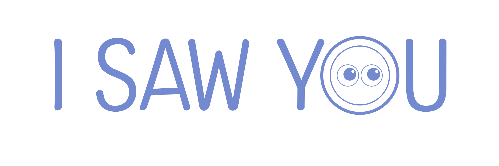
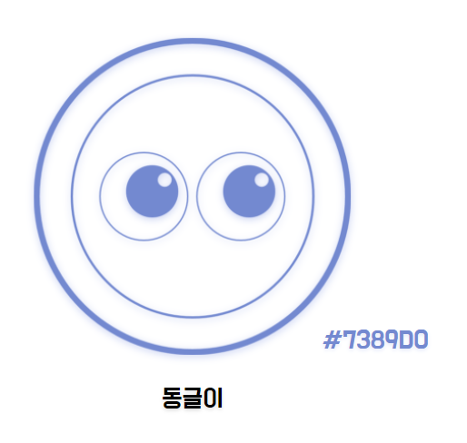
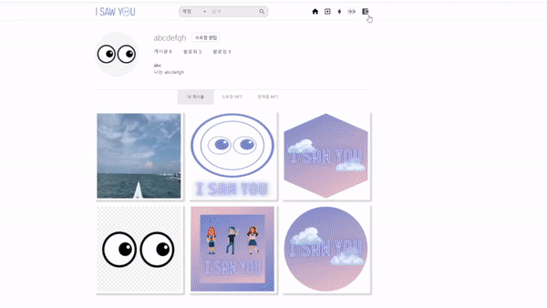
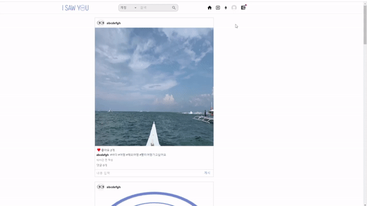
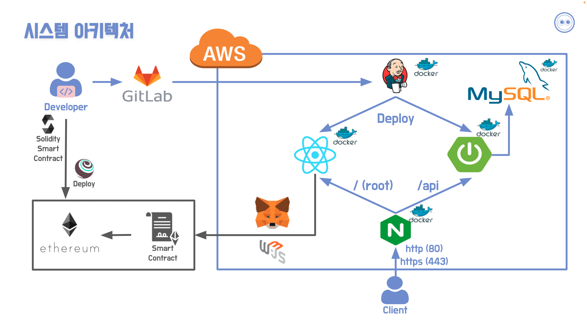

&nbsp;

## 소개 😀

✔ 사용자의 추억을 자유롭게 업로드하고 공유할 수 있습니다.

✔ 컨텐츠를 NFT화 하여 **소유(saw you)**, 거래할 수 있는 SNS (Social NFT Service) 서비스입니다.

&nbsp;

## 마스코트 👀

&nbsp;

## 주요 기능 📌

##### 작성한 게시글을 민팅

&nbsp;

##### 보유한 NFT를 판매 등록

&nbsp;

##### 판매중인 NFT를 구매

&nbsp;

##### 구매한 NFT 확인

&nbsp;

## 기술 스택 🛠

#### Back-end

&nbsp;&nbsp;&nbsp;&nbsp;

&nbsp;

#### Front-end

&nbsp;&nbsp;&nbsp;

&nbsp;

#### Smart-Contract

&nbsp;&nbsp;&nbsp;

&nbsp;

#### Server

&nbsp;&nbsp;

&nbsp;

## 개발 기간 📅

##### 2022. 02. 28 ~ 2022. 04. 08 (6주)

&nbsp;

## 팀원 구성 🤝

|                 김정혁 (팀장)                  |                     문준호                     |                     김영후                     |                     이상원                     |                     오나연                     |                     박건우                     |
| :--------------------------------------------: | :--------------------------------------------: | :--------------------------------------------: | :--------------------------------------------: | :--------------------------------------------: | :--------------------------------------------: |
|  |  |  |  |  |  |
|                 Smart-Contract                 |                 Smart-Contract                 |                    Frontend                    |                    Frontend                    |                  Backend, UCC                  |                    Backend, CI/CD           |

&nbsp;

##  시스템 아키텍쳐 ⚙

&nbsp;

## 바로가기 👉

 

